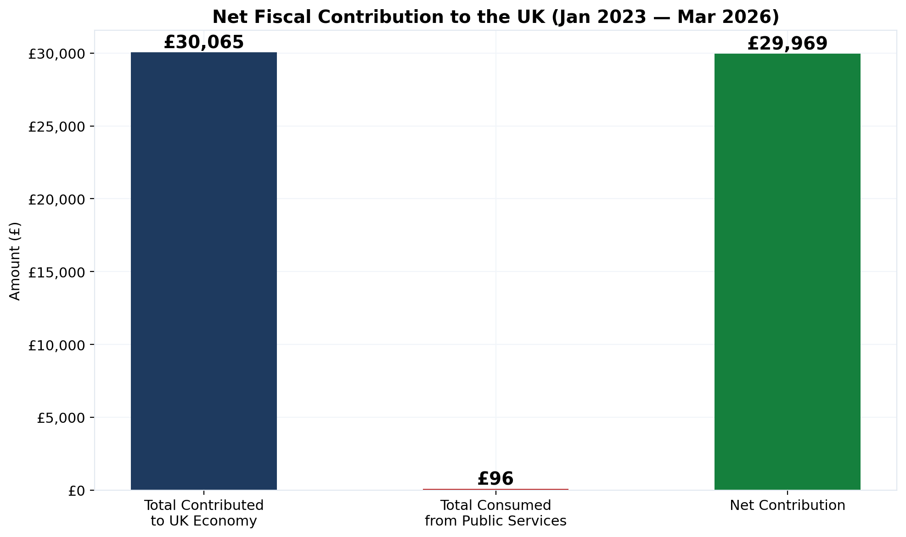
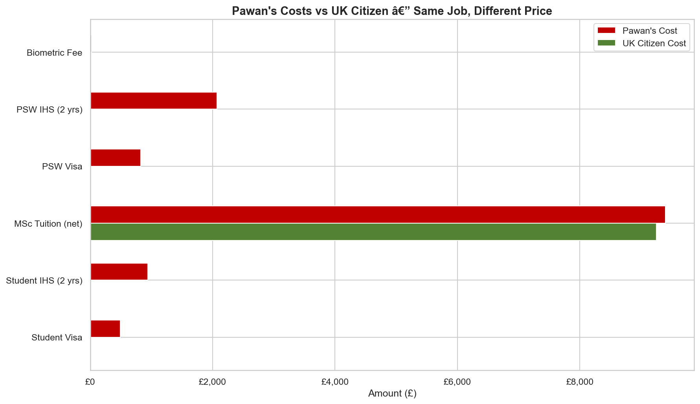
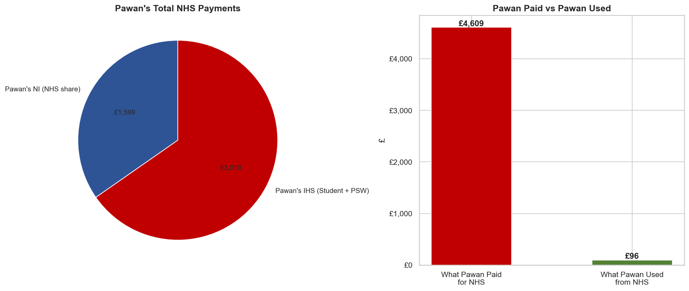
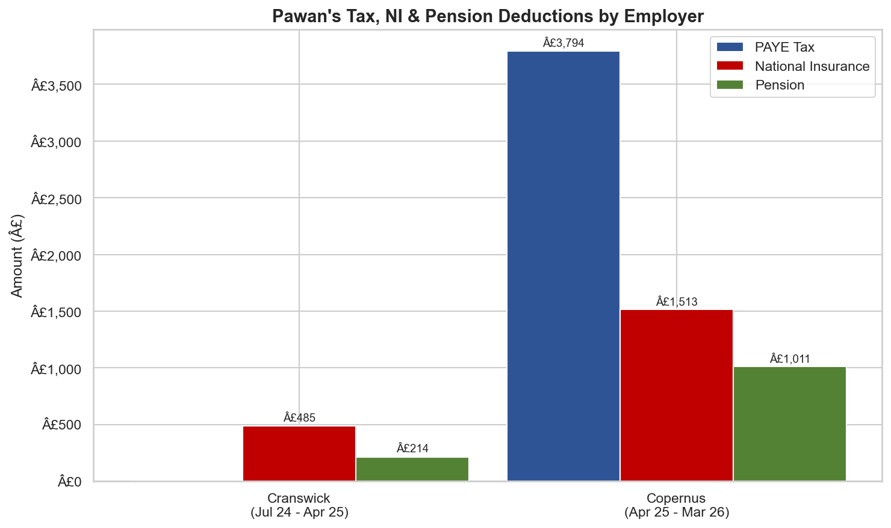
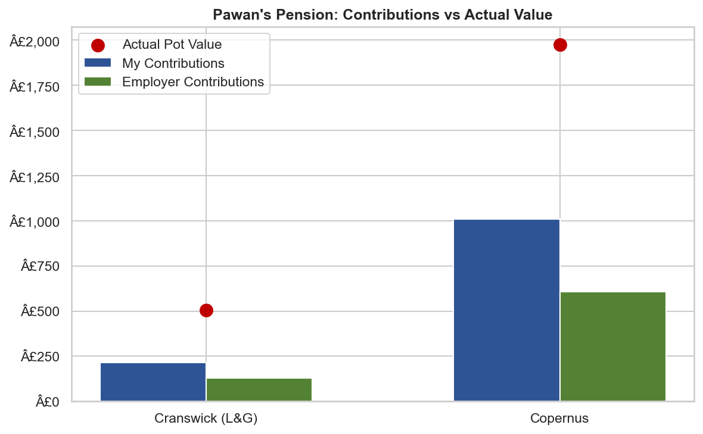

# PSW Graduate Visa: A Cost-Benefit Analysis

**Research question:** What is the net fiscal contribution of a Post-Study Work visa holder to the UK economy, and how does the cost structure compare to a UK citizen in equivalent employment?

## Executive Summary

| Metric | Value |
|---|---|
| **Net contribution to the UK** | **£31,090** |
| Total contributed (tax, NI, visa fees, tuition, VAT, council tax) | £31,186 |
| Total consumed from public services | £96 |
| Additional cost vs UK citizen (same job, same pay) | £4,491 |
| NHS payments made | £4,634 |
| NHS services consumed | £96 (one A&E visit) |
| Benefits claimed | £0 |
| Period covered | Jan 2023 – Apr 2026 (2.7 years) |

This analysis uses verified payslip data, pension provider statements, HMRC tax rates, and Home Office fee schedules. Every figure is sourced and reproducible.

---

## Key Findings

### 1. Net Fiscal Position: +£31,525

Over 2.7 years in the UK, total contributions to the economy reached £31,186 across income tax, National Insurance, employer NI, visa fees, international tuition, VAT, and council tax. Total public service consumption was £96 — a single A&E attendance (NHS Reference Cost VB11Z: Type 1, no investigation).



### 2. Cost Premium Over UK Citizens: £4,087

A UK citizen performing the same role at the same hourly rate pays identical income tax and National Insurance. A PSW visa holder pays an additional £4,491 in immigration-specific costs: student visa (£490), student IHS (£940), PSW visa (£822), PSW IHS (£2,070), biometric fee (£19), and an international tuition premium of £150 after scholarship (international fee £17,400 minus £8,000 merit scholarship = £9,400 paid, vs UK home fee £9,250).



### 3. Duplicate NHS Charging

National Insurance contributions fund the NHS. The Immigration Health Surcharge also funds the NHS. A PSW holder pays for the same service through two separate mechanisms.

| Channel | Amount paid |
|---|---|
| National Insurance (NHS share, ~80%) | £1,624 |
| Immigration Health Surcharge (Student + PSW) | £3,010 |
| **Total NHS payments** | **£4,634** |
| NHS services consumed | £96 |

A UK citizen on identical earnings pays £1,624 for NHS access. A PSW holder pays £4,634 — a 185% premium for the same entitlement.



### 4. No Recourse to Public Funds

Despite contributing to the tax and NI system, PSW visa holders cannot claim Universal Credit, housing benefit, jobseeker's allowance, or any state support. The contribution is unidirectional.

---

## Data Sources

| Source | What it provides |
|---|---|
| Payslips — Cranswick Convenience Foods (Jul 2024 – Apr 2025) | Gross pay, PAYE, NI, pension deductions |
| Payslips + P60 — Copernus Ltd (Apr 2025 – Apr 2026) | Gross pay, PAYE, NI, pension deductions |
| Legal & General and Copernus pension provider portals | Confirmed pot values (£504.31 + £1,975.39) |
| Home Office fee schedule | Visa application and IHS costs |
| HMRC 2024/25 and 2025/26 tax tables | Income tax bands, NI thresholds |
| NHS Reference Costs 2022-23 | A&E unit cost (VB11Z = £96) |
| ONS | NHS expenditure per capita (£4,257/year) |

## Employment Timeline

| Employer | Role | Period | Hourly Rate | Gross Earnings |
|---|---|---|---|---|
| Cranswick Convenience Foods | Production Operative | Jul 2024 – Apr 2025 | £12.11 | £11,605 |
| Copernus Ltd | Team Leader | Apr 2025 – Apr 2026 | £14.00 | £30,640 |
| **Total** | | **21 months** | | **£42,246** |

### Copernus Ltd — P60 Verified (Tax Year 2025/26)

| Field | Amount |
|---|---|
| Gross Pay (P60) | £30,640.28 |
| Income Tax Paid (P60) | £3,932.80 |
| Employee National Insurance | £1,545.00 |
| Employee Pension | £1,036.41 |
| Employer National Insurance | £3,969.93 |
| Employer Pension | £621.83 |



## Methodology

1. **Data collection** — year-to-date totals extracted from final payslips for each employer. Pension balances confirmed directly from provider portals.
2. **Cost modelling** — immigration costs sourced from Home Office published fee schedules. NHS share of NI estimated at 80% per ONS health expenditure data.
3. **Comparison framework** — UK citizen baseline calculated using identical gross earnings through HMRC tax and NI calculators, removing all immigration-specific costs.
4. **Visualisation** — six charts generated via matplotlib, each isolating a single comparison for clarity.
5. **Excel export** — structured workbook with six sheets for independent verification.

## Pension Position

| Provider | Employee | Employer | Pot Value |
|---|---|---|---|
| Legal & General (Cranswick) | £214 | £130 | £504 |
| Workplace Pension (Copernus) | £1,036 | £622 | £2,016 |
| **Total** | **£1,251** | **£752** | **£2,520** |



Both schemes are salary sacrifice (pre-tax). Funds are accessible from age 57, or transferable to a QROPS if leaving the UK.

## Repository Structure

```
uk-immigration-tax-fairness/
├── PSW_Tax_Contribution_Analysis.ipynb    # Full analysis with all calculations
├── UK_Immigration_Tax_Fairness.xlsx       # 6-sheet Excel report for stakeholders
├── charts/                                # 6 publication-ready visualisations
│   ├── 01_tax_ni_by_employer.png
│   ├── 02_pawan_vs_uk_citizen.png
│   ├── 03_nhs_double_charge.png
│   ├── 04_net_contribution.png
│   ├── 05_vs_average_uk.png
│   └── 06_pension.png
└── README.md
```

## How to Reproduce

```bash
pip install pandas matplotlib seaborn openpyxl
jupyter notebook PSW_Tax_Contribution_Analysis.ipynb
```

The notebook regenerates all charts and the Excel workbook from the embedded data. No external API calls required.

## Tools

| Tool | Purpose |
|---|---|
| Python 3.11 | Analysis runtime |
| pandas | Data manipulation and aggregation |
| matplotlib / seaborn | Statistical visualisation |
| openpyxl | Excel report generation with formatting |
| Jupyter | Reproducible notebook-based analysis |
